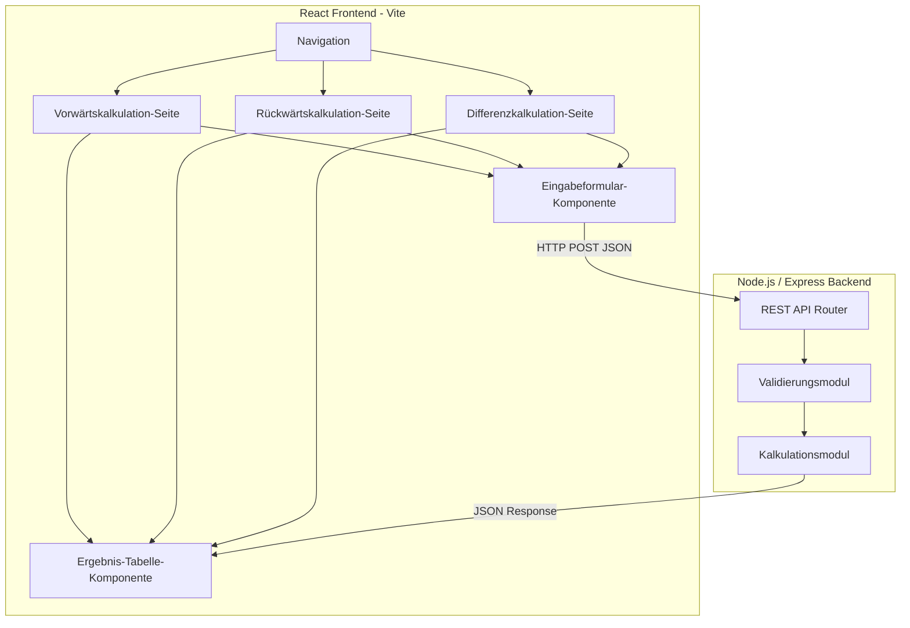

# Design-Dokument: Einkaufs- und Verkaufskalkulation

## Übersicht

Die Anwendung ist ein Lernprojekt für Schüler der 9. Klasse Wirtschaftsschule. Sie besteht aus einem React-Frontend und einem Node.js/Express-Backend. Das Frontend bietet Formulare für die drei Kalkulationsarten (Vorwärts-, Rückwärts- und Differenzkalkulation). Das Backend führt die Berechnungen durch und gibt die Ergebnisse als JSON zurück.

Die Architektur ist bewusst einfach gehalten, damit ein Programmieranfänger sie verstehen und schrittweise aufbauen kann.

### Technologie-Stack

- **Frontend**: React (mit Vite als Build-Tool)
- **Backend**: Node.js mit Express
- **Sprache**: JavaScript (kein TypeScript, um die Einstiegshürde niedrig zu halten)
- **Tests**: Vitest (für Backend-Logik), fast-check (für Property-Based Tests)
- **Styling**: Einfaches CSS (kein Framework, damit CSS-Grundlagen gelernt werden)

### Sprachkonvention

- **Programmcode** (Variablen, Funktionen, Dateinamen): Englisch
- **Kommentare im Code**: Deutsch
- **UI-Texte** (Labels, Fehlermeldungen, Beschriftungen): Deutsch
- **JSON-Schlüssel**: Englisch (z.B. `listPurchasePrice`, nicht `listeneinkaufspreis`)
- **JSON-Werte für Anzeige** (Labels in `steps`): Deutsch (z.B. `"Listeneinkaufspreis"`)

## Architektur



### Kommunikation

- Frontend sendet HTTP POST Requests mit JSON-Body an das Backend
- Backend antwortet mit JSON-Objekten, die alle Zwischenergebnisse enthalten
- Keine Datenbank nötig — alle Berechnungen sind zustandslos

### Validierungsstrategie

- **Backend**: Vollständige Validierung aller Eingaben (Pflichtfelder, Datentypen, Wertebereiche). Das Backend ist die „Single Source of Truth" für Validierung — dem Frontend wird nie vertraut.
- **Frontend**: Nur minimale Prüfung vor dem Absenden (sind alle Felder ausgefüllt?). Das gibt dem Benutzer schnelles Feedback, ohne die Logik zu duplizieren.
- **Lerneffekt**: Der Schüler lernt, dass Validierung immer serverseitig stattfinden muss, auch wenn das Frontend bereits prüft.

## Komponenten und Schnittstellen

### Backend-Komponenten

#### 1. Kalkulationsmodul (`backend/src/calculation.js`)

Enthält die reine Berechnungslogik, getrennt vom HTTP-Layer. Code ist auf Englisch, Kommentare auf Deutsch.

```javascript
// Vorwärtskalkulation: Listeneinkaufspreis → Listenverkaufspreis
function calculateForward(input) {
  // input: { listPurchasePrice, supplierDiscount, supplierCashDiscount,
  //          procurementCosts, overheadSurcharge, profitSurcharge,
  //          customerCashDiscount, customerDiscount }
  // returns: { targetPurchasePrice, netPurchasePrice, procurementPrice,
  //            costPrice, netSellingPrice, targetSellingPrice,
  //            listSellingPrice, steps }
}

// Rückwärtskalkulation: Listenverkaufspreis → Listeneinkaufspreis
function calculateBackward(input) {
  // input: { listSellingPrice, customerDiscount, customerCashDiscount,
  //          profitSurcharge, overheadSurcharge, procurementCosts,
  //          supplierCashDiscount, supplierDiscount }
  // returns: { targetSellingPrice, netSellingPrice, costPrice,
  //            procurementPrice, netPurchasePrice, targetPurchasePrice,
  //            listPurchasePrice, steps }
}

// Differenzkalkulation: Gewinn ermitteln
function calculateDifference(input) {
  // input: { listPurchasePrice, supplierDiscount, supplierCashDiscount,
  //          procurementCosts, overheadSurcharge,
  //          listSellingPrice, customerDiscount, customerCashDiscount }
  // returns: { costPrice, netSellingPrice, profit, profitPercent, steps }
}

// Hilfsfunktion: Auf 2 Nachkommastellen runden
function roundToTwo(value) {
  return Math.round(value * 100) / 100;
}
```

#### Berechnungsformeln

**Vorwärtskalkulation (Einkauf):**
```
Listeneinkaufspreis
- Liefererrabatt (% vom Listeneinkaufspreis)
= Zieleinkaufspreis
- Liefererskonto (% vom Zieleinkaufspreis)
= Bareinkaufspreis
+ Bezugskosten
= Bezugspreis (Einstandspreis)
```

**Vorwärtskalkulation (Verkauf):**
```
Bezugspreis
+ Handlungskostenzuschlag (% vom Bezugspreis)
= Selbstkostenpreis
+ Gewinnzuschlag (% vom Selbstkostenpreis)
= Barverkaufspreis
+ Kundenskonto → Zielverkaufspreis = Barverkaufspreis / (1 - Skontosatz/100)
+ Kundenrabatt → Listenverkaufspreis = Zielverkaufspreis / (1 - Rabattsatz/100)
```

**Rückwärtskalkulation (umgekehrte Richtung):**
```
Listenverkaufspreis
- Kundenrabatt → Zielverkaufspreis = Listenverkaufspreis * (1 - Rabattsatz/100)
- Kundenskonto → Barverkaufspreis = Zielverkaufspreis * (1 - Skontosatz/100)
- Gewinnzuschlag → Selbstkostenpreis = Barverkaufspreis / (1 + Gewinnzuschlag/100)
- Handlungskostenzuschlag → Bezugspreis = Selbstkostenpreis / (1 + HKZ/100)
- Bezugskosten → Bareinkaufspreis = Bezugspreis - Bezugskosten
+ Liefererskonto → Zieleinkaufspreis = Bareinkaufspreis / (1 - Skontosatz/100)
+ Liefererrabatt → Listeneinkaufspreis = Zieleinkaufspreis / (1 - Rabattsatz/100)
```

**Differenzkalkulation:**
```
Einkaufsseite: Listeneinkaufspreis → Bezugspreis → Selbstkostenpreis (wie Vorwärts)
Verkaufsseite: Listenverkaufspreis → Barverkaufspreis (wie Rückwärts)
Gewinn = Barverkaufspreis - Selbstkostenpreis
Gewinn% = (Gewinn / Selbstkostenpreis) * 100
```

#### 2. Validierungsmodul (`backend/src/validation.js`)

```javascript
// Validiert Eingabedaten und gibt Fehlermeldungen zurück
function validateInput(data, fields) {
  // fields: Array von { name, type: 'amount' | 'percent', required: boolean }
  // returns: { valid: boolean, errors: [{ field, message }] }
}
```

Validierungsregeln:
- Pflichtfelder dürfen nicht leer sein
- Werte müssen numerisch sein
- Beträge dürfen nicht negativ sein
- Prozentwerte müssen zwischen 0 und 100 liegen (exklusive 100 bei Skonto/Rabatt)

#### 3. REST API Router (`backend/src/routes.js`)

| Endpunkt | Methode | Beschreibung |
|---|---|---|
| `/api/forward` | POST | Vorwärtskalkulation (komplett) |
| `/api/backward` | POST | Rückwärtskalkulation |
| `/api/difference` | POST | Differenzkalkulation |

Jeder Endpunkt:
1. Empfängt JSON-Body mit Eingabedaten
2. Validiert die Eingaben über das Validierungsmodul
3. Führt die Berechnung über das Kalkulationsmodul durch
4. Gibt das Ergebnis als JSON zurück (oder HTTP 400 bei Fehlern)

### Frontend-Komponenten

#### 1. App-Komponente (`frontend/src/App.jsx`)
- Enthält die Navigation (Tabs oder Links)
- Rendert die aktive Kalkulationsseite

#### 2. Seiten-Komponenten
- `ForwardPage.jsx` — Formular und Ergebnis für Vorwärtskalkulation
- `BackwardPage.jsx` — Formular und Ergebnis für Rückwärtskalkulation
- `DifferencePage.jsx` — Formular und Ergebnis für Differenzkalkulation

#### 3. Wiederverwendbare Komponenten
- `InputField.jsx` — Einzelnes Eingabefeld mit Label, Validierung und Fehlermeldung
- `ResultTable.jsx` — Tabelle zur Darstellung des Kalkulationsschemas
- `ErrorDisplay.jsx` — Anzeige von Backend-Fehlermeldungen

#### API-Aufruf

```javascript
// frontend/src/api.js
// Sendet eine Kalkulationsanfrage an das Backend
async function calculate(calculationType, input) {
  const response = await fetch(`/api/${calculationType}`, {
    method: 'POST',
    headers: { 'Content-Type': 'application/json' },
    body: JSON.stringify(input)
  });
  if (!response.ok) {
    const error = await response.json();
    throw new Error(error.message || 'Berechnungsfehler');
  }
  return response.json();
}
```

## Datenmodelle

### Eingabe-Objekte (JSON)

**Vorwärtskalkulation:**
```json
{
  "listPurchasePrice": 100.00,
  "supplierDiscount": 10,
  "supplierCashDiscount": 2,
  "procurementCosts": 5.00,
  "overheadSurcharge": 25,
  "profitSurcharge": 10,
  "customerCashDiscount": 3,
  "customerDiscount": 5
}
```

**Rückwärtskalkulation:**
```json
{
  "listSellingPrice": 150.00,
  "customerDiscount": 5,
  "customerCashDiscount": 3,
  "profitSurcharge": 10,
  "overheadSurcharge": 25,
  "procurementCosts": 5.00,
  "supplierCashDiscount": 2,
  "supplierDiscount": 10
}
```

**Differenzkalkulation:**
```json
{
  "listPurchasePrice": 100.00,
  "supplierDiscount": 10,
  "supplierCashDiscount": 2,
  "procurementCosts": 5.00,
  "overheadSurcharge": 25,
  "listSellingPrice": 150.00,
  "customerDiscount": 5,
  "customerCashDiscount": 3
}
```

### Ergebnis-Objekte (JSON)

**Vorwärtskalkulation-Ergebnis:**
```json
{
  "steps": [
    { "label": "Listeneinkaufspreis", "value": 100.00 },
    { "label": "- Liefererrabatt (10%)", "value": 10.00 },
    { "label": "= Zieleinkaufspreis", "value": 90.00 },
    { "label": "- Liefererskonto (2%)", "value": 1.80 },
    { "label": "= Bareinkaufspreis", "value": 88.20 },
    { "label": "+ Bezugskosten", "value": 5.00 },
    { "label": "= Bezugspreis", "value": 93.20 },
    { "label": "+ Handlungskostenzuschlag (25%)", "value": 23.30 },
    { "label": "= Selbstkostenpreis", "value": 116.50 },
    { "label": "+ Gewinnzuschlag (10%)", "value": 11.65 },
    { "label": "= Barverkaufspreis", "value": 128.15 },
    { "label": "+ Kundenskonto (3%)", "value": 3.96 },
    { "label": "= Zielverkaufspreis", "value": 132.11 },
    { "label": "+ Kundenrabatt (5%)", "value": 6.95 },
    { "label": "= Listenverkaufspreis", "value": 139.06 }
  ]
}
```

Das `steps`-Array ermöglicht eine einheitliche Darstellung in der Ergebnis-Tabelle für alle drei Kalkulationsarten. Die `label`-Felder sind auf Deutsch, da sie dem Benutzer angezeigt werden.

### Fehler-Objekt (JSON)

```json
{
  "errors": [
    { "field": "listPurchasePrice", "message": "Bitte gib einen Wert ein" },
    { "field": "supplierDiscount", "message": "Der Prozentwert darf nicht größer als 100 sein" }
  ]
}
```

### Meilenstein-Struktur

| Meilenstein | Git-Tag | Beschreibung |
|---|---|---|
| 0 | `v0-projektstart` | Projektstruktur, npm init, Abhängigkeiten installieren (auch VSCode, Git, etc.) |
| 1 | `v1-backend-grundgeruest` | Express-Server mit einem einfachen Test-Endpunkt |
| 2 | `v2-einkaufskalkulation` | Backend-Logik für Einkaufskalkulation + Tests |
| 3 | `v3-verkaufskalkulation` | Backend-Logik für Verkaufskalkulation + Tests |
| 4 | `v4-frontend-grundgeruest` | React-App mit Vite, Navigation, erstes Formular |
| 5 | `v5-vorwaerts-komplett` | Vorwärtskalkulation Frontend + Backend verbunden |
| 6 | `v6-rueckwaerts` | Rückwärtskalkulation komplett |
| 7 | `v7-differenz` | Differenzkalkulation komplett |
| 8 | `v8-validierung` | Eingabevalidierung Frontend + Backend |
| 9 | `v9-fertig` | Feinschliff, Styling, finale Version |


## Korrektheitseigenschaften (Correctness Properties)

*Eine Korrektheitseigenschaft ist ein Merkmal oder Verhalten, das für alle gültigen Ausführungen eines Systems gelten muss — im Grunde eine formale Aussage darüber, was das System tun soll. Eigenschaften bilden die Brücke zwischen menschenlesbaren Spezifikationen und maschinell überprüfbaren Korrektheitsgarantien.*

### Property 1: Round-Trip Vorwärts-/Rückwärtskalkulation

*Für alle* gültigen Eingabewerte (Listeneinkaufspreis > 0, alle Prozentsätze zwischen 0 und 99, Bezugskosten ≥ 0) soll gelten: Wenn man eine Vorwärtskalkulation durchführt und anschließend mit denselben Prozentsätzen eine Rückwärtskalkulation vom berechneten Listenverkaufspreis startet, muss der resultierende Listeneinkaufspreis dem ursprünglichen Listeneinkaufspreis entsprechen (bis auf Rundungsdifferenzen von maximal 0,01 €).

**Validates: Requirements 1.1, 2.1, 3.1, 4.1**

### Property 2: Hundert-im-Hundert-Rechnung für Skonto und Rabatt

*Für alle* gültigen Barverkaufspreise und Skontosätze (0 < Skonto < 100) soll gelten: Der Zielverkaufspreis wird als `Barverkaufspreis / (1 - Skontosatz/100)` berechnet, nicht als `Barverkaufspreis * (1 + Skontosatz/100)`. Analog für Kundenrabatt: `Zielverkaufspreis / (1 - Rabattsatz/100)`. Dies stellt sicher, dass die kaufmännisch korrekte „Vom-Hundert-Rechnung" verwendet wird.

**Validates: Requirements 2.3**

### Property 3: Differenzkalkulation Gewinnberechnung

*Für alle* gültigen Eingaben der Differenzkalkulation soll gelten: Der berechnete Gewinn entspricht der Differenz zwischen Barverkaufspreis und Selbstkostenpreis, und der Gewinnprozentsatz entspricht `(Gewinn / Selbstkostenpreis) * 100`.

**Validates: Requirements 5.1**

### Property 4: Rundung auf zwei Nachkommastellen

*Für alle* Berechnungsergebnisse (Vorwärts-, Rückwärts- und Differenzkalkulation) soll gelten: Jeder Wert im `schritte`-Array hat maximal zwei Nachkommastellen.

**Validates: Requirements 6.2**

### Property 5: Validierung lehnt ungültige Eingaben ab

*Für alle* Eingabeobjekte, die mindestens ein ungültiges Feld enthalten (leerer Wert, nicht-numerischer Wert, negativer Betrag), soll gelten: Die Validierungsfunktion gibt `gueltig: false` zurück und das `fehler`-Array enthält mindestens einen Eintrag mit dem betroffenen Feldnamen.

**Validates: Requirements 1.3, 6.3, 8.1, 8.2, 8.3**

### Property 6: Prozentwerte nur im Bereich 0–100

*Für alle* Eingabeobjekte, bei denen ein Prozentfeld einen Wert größer als 100 oder kleiner als 0 enthält, soll gelten: Die Validierungsfunktion gibt `gueltig: false` zurück und das `fehler`-Array enthält einen Eintrag für das betroffene Feld.

**Validates: Requirements 1.4, 8.4**

### Property 7: JSON-Serialisierung Round-Trip

*Für alle* gültigen Kalkulationseingabe-Objekte soll gelten: `JSON.parse(JSON.stringify(eingabe))` ergibt ein Objekt, das dem Original entspricht (alle Werte sind identisch).

**Validates: Requirements 10.1, 10.2, 10.3**

### Property 8: Ergebnis enthält alle erwarteten Schritte

*Für alle* gültigen Vorwärtskalkulationen soll gelten: Das Ergebnis-Objekt enthält ein `schritte`-Array mit genau 15 Einträgen (Listeneinkaufspreis bis Listenverkaufspreis). Für Rückwärtskalkulationen enthält es ebenfalls alle Schritte in umgekehrter Reihenfolge.

**Validates: Requirements 1.2, 2.2, 4.2**

### Property 9: Formatierung von Beträgen und Prozenten

*Für alle* numerischen Werte soll gelten: Die Betragsformatierung erzeugt einen String mit genau zwei Nachkommastellen und dem Euro-Zeichen (z.B. „123,45 €"). Die Prozentformatierung erzeugt einen String mit dem Prozentzeichen (z.B. „10 %").

**Validates: Requirements 7.4, 7.5**

## Fehlerbehandlung

### Backend-Fehler

| Fehlerfall | HTTP-Status | Antwort |
|---|---|---|
| Ungültige Eingabedaten | 400 | `{ "errors": [{ "field": "...", "message": "..." }] }` |
| Fehlende Pflichtfelder | 400 | `{ "errors": [{ "field": "...", "message": "Bitte gib einen Wert ein" }] }` |
| Nicht-numerische Werte | 400 | `{ "errors": [{ "field": "...", "message": "Bitte gib eine gültige Zahl ein" }] }` |
| Negative Werte | 400 | `{ "errors": [{ "field": "...", "message": "Der Wert darf nicht negativ sein" }] }` |
| Prozentwert > 100 | 400 | `{ "errors": [{ "field": "...", "message": "Der Prozentwert darf nicht größer als 100 sein" }] }` |
| Division durch Null (Skonto/Rabatt = 100%) | 400 | `{ "errors": [{ "field": "...", "message": "Der Prozentwert darf nicht 100 sein" }] }` |
| Unerwarteter Serverfehler | 500 | `{ "errors": [{ "message": "Ein unerwarteter Fehler ist aufgetreten" }] }` |

### Frontend-Fehler

- Netzwerkfehler: Anzeige von „Verbindung zum Server fehlgeschlagen. Bitte prüfe, ob der Server läuft."
- Validierungsfehler vom Backend: Anzeige der Fehlermeldungen neben den betroffenen Feldern
- Unerwartete Fehler: Anzeige einer allgemeinen Fehlermeldung

### Division durch Null

Bei der Hundert-im-Hundert-Rechnung (z.B. `Barverkaufspreis / (1 - Skonto/100)`) würde ein Skontosatz von genau 100% zu einer Division durch Null führen. Die Validierung muss Prozentwerte von genau 100% bei Skonto und Rabatt ablehnen, da diese kaufmännisch keinen Sinn ergeben.

## Teststrategie

### Testframework

- **Vitest** für Unit-Tests und Property-Based Tests
- **fast-check** als Property-Based Testing Bibliothek (Integration mit Vitest)
- Tests werden im Backend ausgeführt, da die Berechnungslogik dort liegt

### Unit-Tests

Unit-Tests prüfen spezifische Beispiele und Edge-Cases:

- **Bekannte Kalkulationsbeispiele**: Manuell berechnete Beispiele aus dem Schulbuch nachrechnen
- **Grenzwerte**: Alle Prozentsätze = 0, Bezugskosten = 0, minimale Werte
- **Edge-Cases**: Sehr große Zahlen, sehr kleine Beträge (0,01 €)
- **Validierung**: Spezifische ungültige Eingaben (leere Felder, negative Werte, Buchstaben)

### Property-Based Tests

Property-Based Tests prüfen universelle Eigenschaften über viele zufällige Eingaben:

- Jeder Test läuft mit mindestens **100 Iterationen**
- Jeder Test referenziert die zugehörige Property aus dem Design-Dokument
- Tag-Format: **Feature: einkaufs-verkaufskalkulation, Property {Nummer}: {Titel}**
- Bibliothek: **fast-check** (npm-Paket `fast-check`)

### Teststruktur

```
backend/
  src/
    calculation.js
    validation.js
    routes.js
  tests/
    calculation.test.js      ← Unit-Tests für Berechnungslogik
    calculation.prop.test.js  ← Property-Tests für Berechnungslogik
    validation.test.js       ← Unit-Tests für Validierung
    validation.prop.test.js  ← Property-Tests für Validierung
```

### Testabdeckung

| Property | Testdatei | Beschreibung |
|---|---|---|
| Property 1 | calculation.prop.test.js | Round-Trip Vorwärts/Rückwärts |
| Property 2 | calculation.prop.test.js | Hundert-im-Hundert-Rechnung |
| Property 3 | calculation.prop.test.js | Differenzkalkulation Gewinn |
| Property 4 | calculation.prop.test.js | Rundung auf 2 Nachkommastellen |
| Property 5 | validation.prop.test.js | Ungültige Eingaben abgelehnt |
| Property 6 | validation.prop.test.js | Prozentwerte 0–100 |
| Property 7 | calculation.prop.test.js | JSON Round-Trip |
| Property 8 | calculation.prop.test.js | Ergebnis enthält alle Schritte |
| Property 9 | (Frontend-Hilfsfunktion) | Formatierung Beträge/Prozente |
