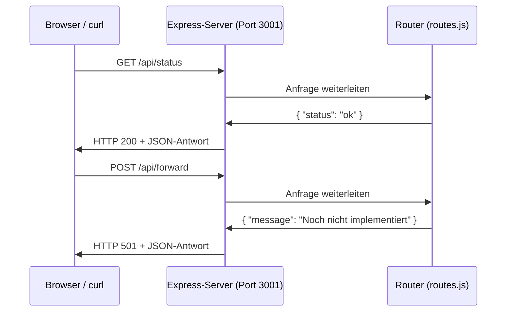

# Meilenstein 1: Backend-Grundgerüst

## Was du in diesem Meilenstein lernst

- Was ein Server ist und wie er auf Anfragen reagiert
- Wie Express Anfragen entgegennimmt und Antworten zurückschickt
- Was ein Router ist und warum man ihn verwendet
- Wie man API-Endpunkte definiert

## Was ist ein Server?

Ein Server ist ein Programm, das ständig läuft und auf Anfragen wartet. Wenn jemand eine URL aufruft (z.B. `http://localhost:3001/api/status`), empfängt der Server diese Anfrage und schickt eine Antwort zurück.

Stell dir den Server wie einen Kellner im Restaurant vor:
1. Der Gast (Browser) gibt eine Bestellung auf (Request)
2. Der Kellner (Server) nimmt die Bestellung entgegen
3. Der Kellner bringt das Essen zurück (Response)

## Wie funktioniert Express?

Express ist ein Framework für Node.js, das es einfach macht, einen Server zu bauen. Ohne Express müsstest du viel mehr Code schreiben, um HTTP-Anfragen zu verarbeiten.

Express arbeitet in drei Schritten:

1. **App erstellen**: `const app = express()` erzeugt eine neue Express-Anwendung
2. **Middleware einrichten**: `app.use(cors())` und `app.use(express.json())` bereiten jede Anfrage vor
3. **Routen definieren**: `app.get('/api/status', ...)` sagt dem Server, was er bei einer bestimmten URL tun soll

## Der Request-Response-Zyklus



### Was bedeuten die Statuscodes?

| Code | Bedeutung | Wann? |
|------|-----------|-------|
| 200 | OK | Alles hat funktioniert |
| 400 | Bad Request | Die Eingabedaten sind ungültig |
| 404 | Not Found | Die URL gibt es nicht |
| 501 | Not Implemented | Die Funktion ist noch nicht programmiert |
| 500 | Internal Server Error | Ein unerwarteter Fehler im Server |

## Was ist ein Router?

Ein Router verteilt eingehende Anfragen an die richtige Funktion. Statt alle Routen direkt in `server.js` zu schreiben, lagern wir sie in eine eigene Datei `routes.js` aus. Das hält den Code übersichtlich.

```
server.js          →  routes.js
app.use('/api', routes)  →  router.get('/status', ...)
                         →  router.post('/forward', ...)
                         →  router.post('/backward', ...)
                         →  router.post('/difference', ...)
```

## Neue Begriffe → [Glossar](glossar.md)

| Begriff | Kurz erklärt |
|---------|-------------|
| Endpunkt | Eine URL, an die man Anfragen schicken kann |
| HTTP | Das Protokoll für die Kommunikation zwischen Browser und Server |
| Request | Eine Anfrage vom Browser an den Server |
| Response | Die Antwort vom Server an den Browser |
| REST-API | Ein Muster, um Daten über HTTP auszutauschen |
| Router | Verteilt Anfragen an die richtige Funktion |
| Statuscode | Eine Zahl, die angibt ob eine Anfrage erfolgreich war |

## Was hat sich im Code geändert?

| Datei | Status | Beschreibung |
|-------|--------|-------------|
| `backend/src/server.js` | Geändert | Router eingebunden, Status-Endpunkt in den Router verschoben |
| `backend/src/routes.js` | Neu | Router mit Status-Endpunkt und drei Platzhalter-Endpunkten |
| `docs/meilenstein-1.md` | Neu | Diese Anleitung |
| `docs/glossar.md` | Erweitert | 7 neue Begriffe hinzugefügt |
| `docs/naechste-schritte.md` | Aktualisiert | Meilenstein 1 als erledigt markiert |

### `backend/src/server.js`

Der Server wurde vereinfacht. Der Status-Endpunkt ist jetzt im Router, und der Server bindet den Router mit `app.use('/api', routes)` ein. So ist der Server nur noch für das Starten und die Middleware zuständig.

### `backend/src/routes.js` (neu)

Der Router definiert vier Endpunkte:
- `GET /status` — gibt `{ "status": "ok" }` zurück (HTTP 200)
- `POST /forward` — Platzhalter für Vorwärtskalkulation (HTTP 501)
- `POST /backward` — Platzhalter für Rückwärtskalkulation (HTTP 501)
- `POST /difference` — Platzhalter für Differenzkalkulation (HTTP 501)

## So testest du den Meilenstein

```bash
# Server starten
cd backend
npm start

# In einem neuen Terminal:
curl http://localhost:3001/api/status
# → {"status":"ok"}

curl -X POST http://localhost:3001/api/forward
# → {"message":"Noch nicht implementiert"} (Status 501)

curl -X POST http://localhost:3001/api/backward
# → {"message":"Noch nicht implementiert"} (Status 501)

curl -X POST http://localhost:3001/api/difference
# → {"message":"Noch nicht implementiert"} (Status 501)
```
