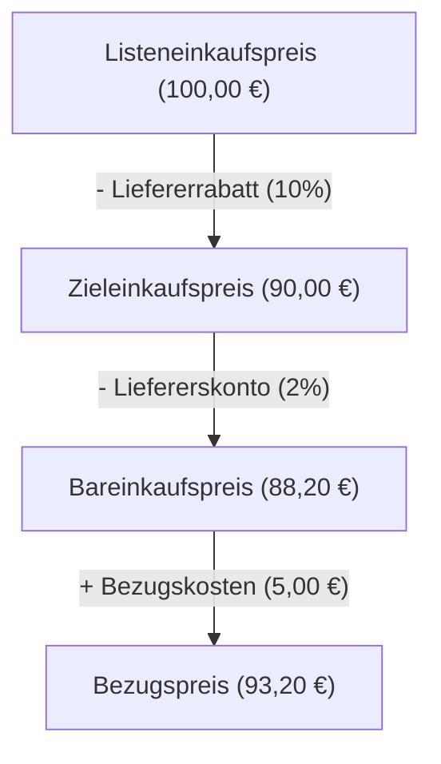

# Meilenstein 2: Einkaufskalkulation Backend

## Was du in diesem Meilenstein lernst

- Wie man **Funktionen** in JavaScript schreibt
- Wie man Berechnungen mit **Variablen** und **Parametern** durchführt
- Wie man Code in **Module** aufteilt und exportiert
- Die Formeln der **Einkaufskalkulation** (Listeneinkaufspreis → Bezugspreis)

## Die Kalkulationsformeln

Die Einkaufskalkulation berechnet, was eine Ware tatsächlich kostet, wenn sie im Lager ankommt. Vom Katalogpreis (Listeneinkaufspreis) werden Rabatt und Skonto abgezogen, dann kommen die Transportkosten (Bezugskosten) dazu.

### Schritt für Schritt

```
Listeneinkaufspreis          (Katalogpreis des Lieferanten)
- Liefererrabatt             (Prozent vom Listeneinkaufspreis)
= Zieleinkaufspreis          (Preis nach Rabatt)
- Liefererskonto             (Prozent vom Zieleinkaufspreis)
= Bareinkaufspreis           (Preis bei sofortiger Zahlung)
+ Bezugskosten               (Transport, Verpackung, etc.)
= Bezugspreis                (Was die Ware wirklich kostet)
```

### Rechenbeispiel

| Schritt | Formel | Ergebnis |
|---------|--------|----------|
| Listeneinkaufspreis | — | 100,00 € |
| - Liefererrabatt (10%) | 100,00 × 10 / 100 = 10,00 | 10,00 € |
| = Zieleinkaufspreis | 100,00 - 10,00 | 90,00 € |
| - Liefererskonto (2%) | 90,00 × 2 / 100 = 1,80 | 1,80 € |
| = Bareinkaufspreis | 90,00 - 1,80 | 88,20 € |
| + Bezugskosten | — | 5,00 € |
| = Bezugspreis | 88,20 + 5,00 | 93,20 € |

### Flussdiagramm



## Wie man Funktionen schreibt

Eine Funktion ist ein wiederverwendbarer Code-Block. Sie hat einen Namen, nimmt Eingaben (Parameter) entgegen und gibt ein Ergebnis zurück.

```javascript
// Einfache Funktion: Rundet auf 2 Nachkommastellen
function roundToTwo(value) {
  return Math.round(value * 100) / 100;
}
```

- `function` — Schlüsselwort, das eine Funktion definiert
- `roundToTwo` — der Name der Funktion
- `(value)` — der Parameter (die Eingabe)
- `return` — gibt das Ergebnis zurück

### Funktionen mit Objekten als Parameter

Wenn eine Funktion viele Eingaben braucht, übergibt man ein Objekt:

```javascript
function calculateForward(input) {
  const { listPurchasePrice, supplierDiscount } = input;
  // ... Berechnung ...
  return { targetPurchasePrice, steps };
}
```

Die Zeile `const { listPurchasePrice, supplierDiscount } = input;` heißt **Destrukturierung** — sie „entpackt" die Werte aus dem Objekt in einzelne Variablen.

## Neue Begriffe

Die folgenden Begriffe werden in diesem Meilenstein eingeführt. Ausführliche Erklärungen findest du im [Glossar](glossar.md).

- **const/let** — Schlüsselwörter zum Erstellen von Variablen
- **Datentyp Number** — Zahlen in JavaScript
- **Funktion** — Wiederverwendbarer Code-Block
- **Modul** — Eine Datei, die Code exportiert
- **Parameter** — Eingabewerte einer Funktion
- **require/module.exports** — Import/Export von Modulen
- **Rückgabewert** — Das Ergebnis einer Funktion
- **Variable** — Benannter Speicherplatz für Werte

## Was hat sich im Code geändert?

| Datei | Status | Beschreibung |
|-------|--------|-------------|
| `backend/src/calculation.js` | **Neu** | Enthält die Einkaufskalkulationslogik: `roundToTwo()` für Rundung und `calculateForward()` für die Berechnung vom Listeneinkaufspreis zum Bezugspreis |
| `backend/tests/calculation.test.js` | **Neu** | Unit-Tests mit bekannten Beispielrechnungen, die prüfen ob die Formeln korrekt implementiert sind |
| `docs/meilenstein-2.md` | **Neu** | Diese Anleitung |
| `docs/glossar.md` | **Erweitert** | 8 neue Begriffe (const/let, Datentyp Number, Funktion, Modul, Parameter, require/module.exports, Rückgabewert, Variable) |
| `docs/naechste-schritte.md` | **Aktualisiert** | Vorschau auf Meilenstein 3 |
