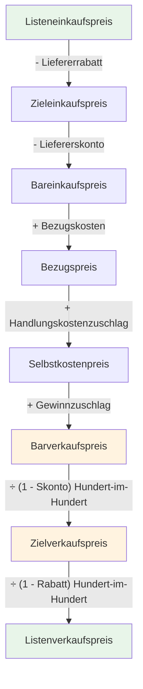
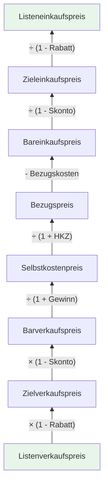

# Meilenstein 3: Verkaufskalkulation Backend

## Was du in diesem Meilenstein lernst

- Wie die Verkaufskalkulation funktioniert (vom Bezugspreis zum Listenverkaufspreis)
- Was die **Hundert-im-Hundert-Rechnung** ist und warum man Division statt Multiplikation verwendet
- Wie die **Rückwärtskalkulation** funktioniert (vom Listenverkaufspreis zurück zum Listeneinkaufspreis)
- Wie die **Differenzkalkulation** den Gewinn ermittelt
- Was **Property-Based Tests** sind und warum sie nützlich sind

## Die Hundert-im-Hundert-Rechnung

Bei der Einkaufskalkulation rechnen wir Rabatt und Skonto als **Abzug** — das ist einfache Prozentrechnung:

```text
Zieleinkaufspreis = Listeneinkaufspreis × (1 - Rabatt/100)
```

Bei der Verkaufskalkulation ist es anders. Kundenskonto und Kundenrabatt werden als **Aufschlag** berechnet. Aber Achtung: Man darf nicht einfach multiplizieren!

### Warum Division statt Multiplikation?

Stell dir vor, der Barverkaufspreis ist 100 € und der Kundenskonto beträgt 3%.

**Falsch** (einfache Multiplikation):
```text
Zielverkaufspreis = 100 × (1 + 0,03) = 103 €
Probe: 103 × (1 - 0,03) = 99,91 € ≠ 100 € ❌
```

**Richtig** (Hundert-im-Hundert):
```text
Zielverkaufspreis = 100 / (1 - 0,03) = 103,09 €
Probe: 103,09 × (1 - 0,03) = 100 € ✅
```

Die Idee: Der Skontosatz bezieht sich auf den **Zielverkaufspreis** (den höheren Wert), nicht auf den Barverkaufspreis. Deshalb müssen wir dividieren, damit die Rückrechnung stimmt.

### Formel

```text
Zielverkaufspreis = Barverkaufspreis / (1 - Skontosatz/100)
Listenverkaufspreis = Zielverkaufspreis / (1 - Rabattsatz/100)
```

## Das vollständige Kalkulationsschema



### Rückwärtskalkulation (umgekehrter Pfad)

Bei der Rückwärtskalkulation gehen wir den Weg von unten nach oben — vom Listenverkaufspreis zurück zum Listeneinkaufspreis. Dabei werden die Formeln umgekehrt:



## Neue Begriffe

Folgende Begriffe werden in diesem Meilenstein eingeführt. Die vollständigen Erklärungen findest du im [Glossar](glossar.md):

| Begriff | Kurz erklärt |
| ------- | ------------ |
| Array | Eine geordnete Liste von Werten |
| Assertion | Eine Behauptung im Test, die wahr sein muss |
| Hundert-im-Hundert-Rechnung | Division statt Multiplikation bei Verkaufsaufschlägen |
| Objekt/Object | Ein Datentyp mit Schlüssel-Wert-Paaren |
| Property-Based Test | Test, der universelle Eigenschaften über viele zufällige Eingaben prüft |
| Testframework | Software zum Schreiben und Ausführen von Tests |
| Unit-Test | Test, der eine einzelne Funktion mit einem konkreten Beispiel prüft |

## Was hat sich im Code geändert?

| Datei | Status | Beschreibung |
| ----- | ------ | ------------ |
| `backend/src/calculation.js` | Erweitert | `calculateForward()` berechnet jetzt die komplette Kalkulation (15 Schritte). Neue Funktionen `calculateBackward()` und `calculateDifference()` |
| `backend/tests/calculation.test.js` | Erweitert | Unit-Tests für Vorwärts-, Rückwärts- und Differenzkalkulation |
| `backend/tests/calculation.prop.test.js` | Neu | Property-Based Tests mit fast-check |
| `docs/glossar.md` | Erweitert | 7 neue Begriffe (Array, Assertion, etc.) |
| `docs/naechste-schritte.md` | Aktualisiert | Vorschau auf Meilenstein 4 |
