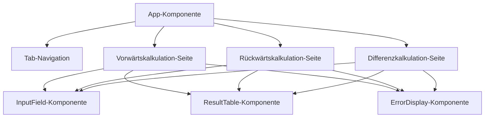

# Meilenstein 4: Frontend-Grundgerüst

## Was du in diesem Meilenstein lernst

In diesem Meilenstein baust du die Benutzeroberfläche (Frontend) für den Kalkulationsrechner. Du lernst, was React ist, wie Komponenten funktionieren und wie du eine einfache Navigation baust.

## Was ist React?

React ist eine JavaScript-Bibliothek zum Bauen von Benutzeroberflächen. Die Grundidee: Du zerlegst deine Seite in kleine, wiederverwendbare Bausteine — sogenannte **Komponenten**. Jede Komponente kümmert sich um einen bestimmten Teil der Seite.

Zum Beispiel:
- Die `App`-Komponente ist der Rahmen der ganzen Anwendung
- Die `InputField`-Komponente ist ein einzelnes Eingabefeld mit Label
- Die `ResultTable`-Komponente zeigt die Ergebnis-Tabelle an

### Wie funktionieren Komponenten?

Eine Komponente ist eine JavaScript-Funktion, die JSX zurückgibt. JSX sieht aus wie HTML, ist aber eigentlich JavaScript:

```jsx
function App() {
  return (
    <div>
      <h1>Hallo Welt</h1>
    </div>
  );
}
```

Komponenten können **Props** empfangen (Daten von außen) und **State** verwalten (eigene Daten, die sich ändern können):

```jsx
// Props: Daten von der Eltern-Komponente
function InputField({ label, value, onChange }) {
  return (
    <div>
      <label>{label}</label>
      <input value={value} onChange={onChange} />
    </div>
  );
}

// State: Eigene Daten mit useState
function App() {
  const [activeTab, setActiveTab] = useState('forward');
  // activeTab ist der aktuelle Wert
  // setActiveTab ist die Funktion zum Ändern
}
```

## Neue Begriffe

Siehe [Glossar](glossar.md) für ausführliche Erklärungen zu:

- **JSX** — HTML-ähnliche Syntax in JavaScript
- **Komponente** — Wiederverwendbarer Baustein der Benutzeroberfläche
- **Props** — Daten, die an eine Komponente übergeben werden
- **Selektor (CSS)** — Muster, das bestimmt, welche HTML-Elemente gestylt werden
- **State** — Veränderbare Daten innerhalb einer Komponente
- **useState** — React-Hook zum Verwalten von State

## Komponentenstruktur



Die `App`-Komponente enthält die Navigation und rendert je nach aktivem Tab eine der drei Seiten. Jede Seite verwendet die gleichen wiederverwendbaren Komponenten (`InputField`, `ResultTable`, `ErrorDisplay`).

## Was hat sich im Code geändert?

| Datei | Status | Beschreibung |
| --- | --- | --- |
| `frontend/src/App.jsx` | Erweitert | Tab-Navigation mit `useState` für die drei Kalkulationsarten |
| `frontend/src/App.css` | Neu | Styling für Navigation, Formulare, Tabellen und Fehleranzeige |
| `frontend/src/components/InputField.jsx` | Neu | Wiederverwendbares Eingabefeld mit Label und Fehlermeldung |
| `frontend/src/components/ResultTable.jsx` | Neu | Tabelle zur Anzeige des `steps`-Arrays mit Euro-/Prozent-Formatierung |
| `frontend/src/components/ErrorDisplay.jsx` | Neu | Anzeige von Backend-Fehlermeldungen |
| `frontend/src/api.js` | Neu | Hilfsfunktion für API-Aufrufe an das Backend |
| `docs/glossar.md` | Erweitert | 6 neue Begriffe (JSX, Komponente, Props, Selektor, State, useState) |

### `App.jsx` — Navigation

Die App verwendet `useState`, um den aktiven Tab zu speichern. Je nachdem, welcher Tab aktiv ist, wird die passende Seite angezeigt. Die Tabs sind als Array definiert, damit man sie einfach mit `.map()` rendern kann.

### Wiederverwendbare Komponenten

- **`InputField`**: Nimmt `label`, `value`, `onChange` und optional `error` als Props. Zeigt ein Eingabefeld mit Label und — falls vorhanden — eine Fehlermeldung darunter.
- **`ResultTable`**: Nimmt ein `steps`-Array als Prop und zeigt es als Tabelle an. Zeilen, die mit `=` beginnen, werden als Ergebnis-Zeilen hervorgehoben.
- **`ErrorDisplay`**: Nimmt ein `errors`-Array als Prop und zeigt die Fehlermeldungen in einer roten Box an.

### `api.js` — API-Hilfsfunktion

Eine einfache Funktion, die `fetch` verwendet, um Kalkulationsanfragen an das Backend zu senden. Sie kümmert sich um die JSON-Serialisierung und Fehlerbehandlung.
