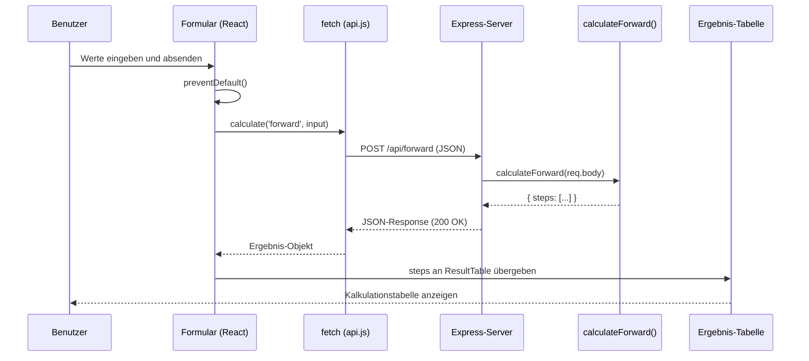

# Meilenstein 5: Vorwärtskalkulation komplett

In diesem Meilenstein verbindest du Frontend und Backend. Du erstellst eine Seite mit einem Formular, das die Eingaben an den Server schickt und das Ergebnis als Kalkulationstabelle anzeigt.

## Was du lernst

- Wie `fetch` HTTP-Requests an das Backend sendet
- Wie `async/await` asynchrone Operationen lesbar macht
- Wie Frontend und Backend über JSON zusammenarbeiten
- Wie Event-Handler auf Benutzeraktionen reagieren

## Wie Frontend und Backend zusammenarbeiten

Wenn der Benutzer das Formular absendet, passiert Folgendes:

1. Der Browser ruft die `handleSubmit`-Funktion auf (Event-Handler)
2. `preventDefault()` verhindert, dass der Browser die Seite neu lädt
3. `fetch` sendet die Eingabedaten als JSON an den Server
4. Der Server berechnet das Ergebnis und schickt es als JSON zurück
5. Das Frontend zeigt das Ergebnis in der Tabelle an

### fetch und async/await

`fetch` ist eine Browser-Funktion, die HTTP-Requests sendet. Da die Antwort vom Server nicht sofort kommt, gibt `fetch` ein **Promise** zurück — ein Objekt, das ein zukünftiges Ergebnis repräsentiert.

Mit `async/await` kannst du auf das Ergebnis warten, ohne verschachtelte Callbacks zu schreiben:

```javascript
// Ohne async/await (verschachtelt und schwer lesbar)
fetch('/api/forward', { method: 'POST', body: JSON.stringify(input) })
  .then((response) => response.json())
  .then((data) => console.log(data));

// Mit async/await (flach und lesbar)
const response = await fetch('/api/forward', { method: 'POST', body: JSON.stringify(input) });
const data = await response.json();
console.log(data);
```

`await` pausiert die Funktion, bis das Promise aufgelöst ist. Die Funktion muss dafür mit `async` markiert sein.

## Datenfluss im Überblick



## Neue Begriffe

In diesem Meilenstein kommen folgende Begriffe dazu (siehe [Glossar](glossar.md)):

- **async/await** — Asynchrone Programmierung in JavaScript
- **Event-Handler** — Funktion, die auf Benutzeraktionen reagiert
- **fetch** — Browser-Funktion zum Senden von HTTP-Requests
- **onSubmit** — Event beim Absenden eines Formulars
- **preventDefault** — Verhindert das Standard-Verhalten des Browsers
- **Promise** — Objekt, das ein zukünftiges Ergebnis repräsentiert

## Was hat sich im Code geändert?

| Datei | Status | Beschreibung |
| --- | --- | --- |
| `frontend/src/pages/ForwardPage.jsx` | Neu | Formular mit 8 Eingabefeldern und Ergebnis-Tabelle für die Vorwärtskalkulation |
| `frontend/src/App.jsx` | Geändert | Importiert und rendert `ForwardPage` statt Platzhalter-Text |
| `frontend/src/App.css` | Erweitert | Styles für Seiten-Titel und -Beschreibung |
| `backend/src/routes.js` | Geändert | POST-Handler für `/api/forward` implementiert — ruft `calculateForward` auf |
| `docs/glossar.md` | Erweitert | 6 neue Begriffe (async/await, Event-Handler, fetch, onSubmit, preventDefault, Promise) |

### ForwardPage.jsx — Die Vorwärtskalkulation-Seite

Diese Komponente enthält:

- **State-Variablen**: `values` (Formulardaten), `result` (Berechnungsergebnis), `errors` (Fehlermeldungen), `loading` (Ladezustand)
- **handleChange**: Aktualisiert ein einzelnes Eingabefeld im State
- **handleSubmit**: Sendet die Eingaben an das Backend und verarbeitet die Antwort
- **Formular**: 8 `InputField`-Komponenten in einem Grid-Layout
- **Ergebnis**: `ResultTable` zeigt das `steps`-Array als Kalkulationstabelle

### routes.js — Der Backend-Endpunkt

Der POST-Handler für `/api/forward`:

1. Empfängt die Eingabedaten aus `req.body`
2. Ruft `calculateForward(req.body)` auf
3. Gibt das Ergebnis als JSON zurück
4. Fängt unerwartete Fehler ab und gibt HTTP 500 zurück
