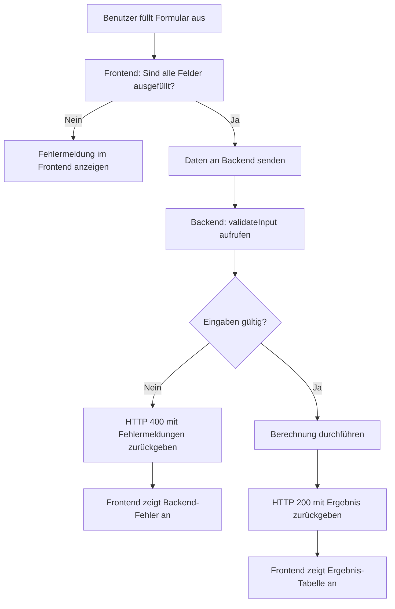

# Meilenstein 8: Eingabevalidierung (v8-validierung)

## Was du in diesem Meilenstein lernst

In diesem Meilenstein lernst du, wie man Benutzereingaben prüft, bevor sie verarbeitet werden. Das nennt man **Validierung**. Validierung ist ein zentrales Konzept in der Softwareentwicklung — sie schützt dein Programm vor fehlerhaften oder gefährlichen Daten.

## Warum Validierung im Backend stattfinden muss

Auch wenn das Frontend bereits prüfen kann, ob alle Felder ausgefüllt sind, darf man sich darauf **niemals verlassen**. Der Grund: Jeder kann HTTP-Requests direkt an das Backend schicken — ohne das Frontend zu benutzen. Zum Beispiel mit `curl` im Terminal oder mit einem eigenen Programm.

Deshalb gilt die Regel: **Das Backend ist die „Single Source of Truth" für Validierung.** Das Frontend darf zusätzlich prüfen (für schnelleres Feedback), aber die echte Prüfung passiert immer im Backend.

## Neue Begriffe

Folgende Begriffe werden in diesem Meilenstein eingeführt — du findest sie im [Glossar](glossar.md):

- Bedingung/if-else
- Fehlerbehandlung
- HTTP-Statuscode 400/500
- try/catch
- Validierung

## Validierungsfluss

Das folgende Diagramm zeigt, wie eine Eingabe geprüft wird:



## Was hat sich im Code geändert?

| Datei | Status | Beschreibung |
| --- | --- | --- |
| `backend/src/validation.js` | **Neu** | Validierungsfunktion `validateInput(data, fields)` mit Regeln für Pflichtfelder, numerische Werte, negative Beträge und Prozentwerte 0–100 |
| `backend/src/routes.js` | **Erweitert** | Alle drei Route-Handler rufen jetzt `validateInput` auf, bevor die Berechnung startet. Bei ungültigen Eingaben wird HTTP 400 zurückgegeben |
| `backend/tests/validation.test.js` | **Neu** | Unit-Tests für die Validierungsfunktion |
| `backend/tests/validation.prop.test.js` | **Neu** | Property-Tests: Ungültige Eingaben werden immer abgelehnt, Prozentwerte nur 0–100 |
| `frontend/src/pages/ForwardPage.jsx` | **Erweitert** | Minimale Frontend-Prüfung (alle Felder ausgefüllt?) und Anzeige von Feld-Fehlern |
| `frontend/src/pages/BackwardPage.jsx` | **Erweitert** | Minimale Frontend-Prüfung und Anzeige von Feld-Fehlern |
| `frontend/src/pages/DifferencePage.jsx` | **Erweitert** | Minimale Frontend-Prüfung und Anzeige von Feld-Fehlern |

### validation.js — Die Validierungsfunktion

Die Funktion `validateInput(data, fields)` bekommt zwei Parameter:
- `data` — das Eingabe-Objekt (z.B. `req.body`)
- `fields` — ein Array mit Felddefinitionen (Name, Typ, Pflichtfeld?)

Für jedes Feld prüft sie der Reihe nach:
1. Ist das Pflichtfeld ausgefüllt?
2. Ist der Wert eine gültige Zahl?
3. Ist der Wert nicht negativ?
4. Liegt ein Prozentwert zwischen 0 und 100?

Bei einem Fehler wird ein Objekt `{ field, message }` zum Fehler-Array hinzugefügt. Am Ende gibt die Funktion `{ valid: true/false, errors: [...] }` zurück.

### routes.js — Validierung vor der Berechnung

Jeder Route-Handler ruft jetzt zuerst `validateInput` auf. Nur wenn `valid === true` ist, wird die Berechnung durchgeführt. Sonst wird HTTP 400 mit den Fehlermeldungen zurückgegeben:

```javascript
const validation = validateInput(req.body, FORWARD_FIELDS);
if (!validation.valid) {
  return res.status(400).json({ errors: validation.errors });
}
```

### Frontend — Minimale Prüfung

Die Seiten-Komponenten prüfen vor dem Absenden, ob alle Felder ausgefüllt sind. Außerdem werden Backend-Fehlermeldungen jetzt neben den betroffenen Feldern angezeigt, nicht nur als allgemeine Fehlermeldung oben.
